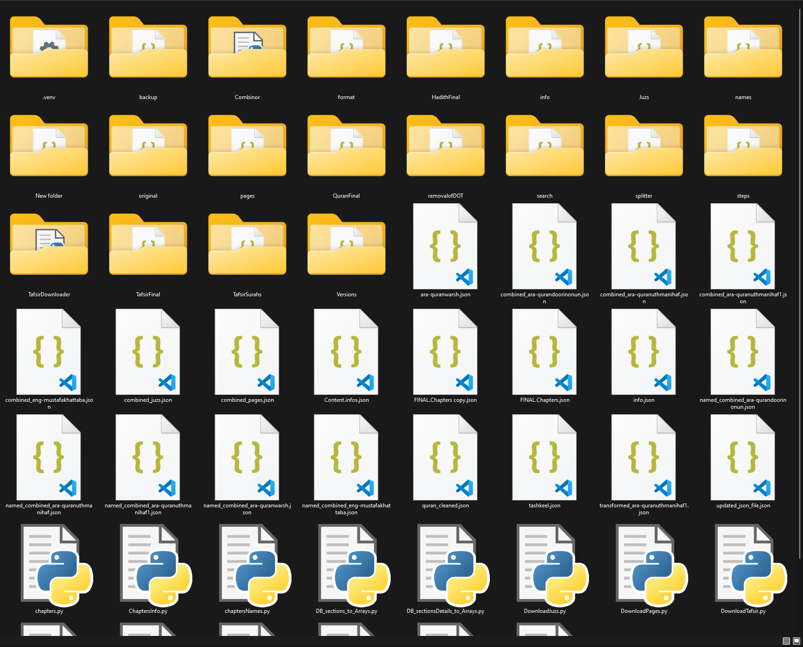
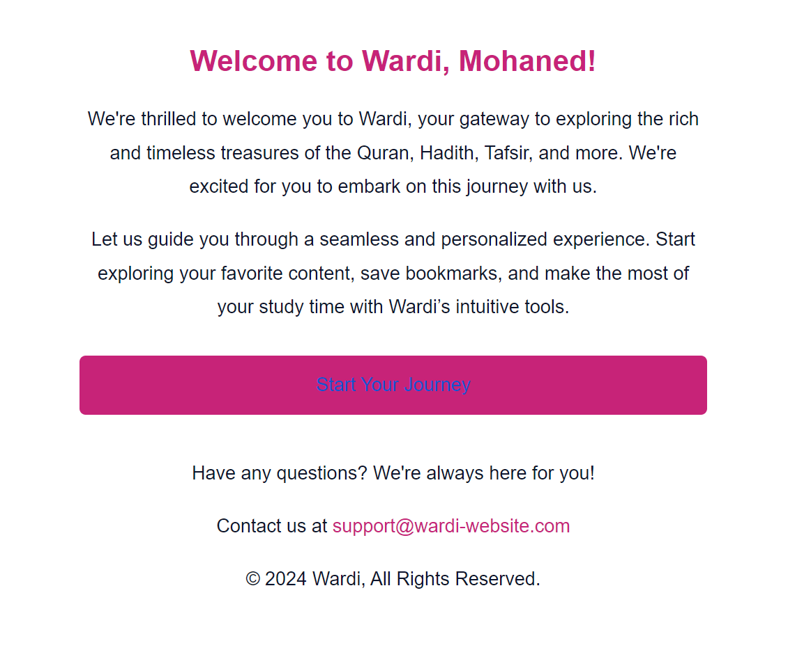

<h1 style="font-family: Arial, sans-serif; font-size: 36px; color: #4A90E2; display: flex; align-items: center; border-bottom: 3px solid #4A90E2; padding-bottom: 5px;">
    
    Welcome to Wardi! 🌟
</h1>

## Introduction

In celebration of the arrival of the Prophet's birthday (Mawlid al-Nabi). I have decided to share my latest Web-Dev Project, **Wardi!**

Wardi is a modern and minimalistic platform designed to enrich your spiritual journey through an enhanced experience of exploring **Quran**, **Hadith**, and **Tafsir**. Blending cutting-edge technology with a spiritual focus, Wardi offers a personalized and seamless reading experience, complete with cloud sync and an intuitive user interface that adapts to all your devices. Whether you’re at home or on the go, Wardi ensures that your connection to these sacred texts remains uninterrupted.

**Accessible At:**  [Wardi's Official Website](https://wardi.onrender.com)

## The Idea 

**The Concept:** I wanted to make an interactive website to sharpen my Web-Dev Skills as a **first project**, and I wanted it to be something that I see myself using everyday, which lead me to making a website for reading Quran, Hadith, Tafsir, with a beatiful interface, bookmarking capabilities, to **motivate myself for reading the quran even more!**, by something I specifically built by my own hands.

**The Name "Wardi:"** was illustrated from the word **وِرْد** (wird) which refers to the daily amount of quran a person reads, and to take it even further, I made the website 's primary font **Pink!** which is a Synonyme to the website's name in arabic

## Features
**You can see the representation video found [here](https://www.youtube.com/watch?v=UM0ln64cOvU&ab_channel=MohanedManaa)**

### 📖 Access to Quran, Hadith, and Tafsir
- Dive deep into a vast library of **Quran**, **Hadith**, and **Tafsir** content available in **Arabic** and **English**, with additional languages to be added soon. Whether you prefer exploring by chapter or verse, Wardi offers flexible access to its content, ensuring that your learning or reading journey remains fluid and insightful.

### 🧘‍♂️ Modern & Minimal Interface
- Wardi embraces a clean and minimal design philosophy, eliminating distractions so you can focus solely on the content. The interface is user-friendly, intuitive, and purpose-built for seamless navigation, so your interaction with sacred texts is uninterrupted by unnecessary clutter.

### 📝 Tailored Reading Options
- Personalize your reading experience! You can choose to read by **chapter**, **juz**, **sections**, or even **pages**. Additionally, Wardi offers flexible font adjustments based on your device’s settings, allowing you to set the perfect reading experience tailored to your preferences. Keep track of your progress with **personalized bookmarks** and never lose your place again.

### 👤 Customizable User Pages
- Your Wardi profile is a reflection of your spiritual journey. Customize your profile with your own personal details and track your progress, preferences, and saved content across devices. You can update your profile picture and information for a fully personalized experience.

### 🔒 Secure & Private
- Security is at the core of Wardi's platform. Your account is protected with **encrypted passwords** using **sha256** encryption, and you can use your **secure inbox mail** for registration and recovery, ensuring your personal data remains safe and private.

### 💾 Persistent Settings & Cloud Sync
- Wardi stores your reading preferences, progress, and bookmarks in the **cloud**, ensuring you can seamlessly pick up where you left off across all your devices. Whether you’re switching from your phone to your tablet or desktop, Wardi syncs your data to provide a consistent experience.

### 📱 Responsive Design
- Whether you’re using a smartphone, tablet, or desktop, Wardi is designed to deliver a smooth and consistent experience. With full **responsive design**, the platform adapts to your device’s screen size and resolution, making it as easy to navigate on a small screen as it is on a larger one.

### 🎨 Beautiful Animations & Visual Feedback
- Every interaction with Wardi is polished and refined. From subtle animations to smooth transitions, Wardi provides **visual feedback** that enhances the **user experience** without taking away from the core focus of reading and exploring.

### 🔖 Advanced Bookmarking System
- Wardi’s bookmarking system allows you to save and organize your favorite **Quran**, **Hadith**, and **Tafsir** content. With the ability to bookmark specific **verses**, **chapters**, or entire **books**, you can easily revisit your most important sections later.

### 💬 Multilingual Interface
- Wardi is prepared for a global audience with its multilingual support, currently offering Arabic and English, with more languages coming soon. Whether you're fluent in Arabic or prefer English translations, the platform caters to both.

## Screenshots & Descriptions 🖼️

### Clean Design  
  
*Description: Wardi’s sleek and minimal interface ensures a distraction-free reading experience.*

### The Quranic Collection  
  
*Description: chose amongst Warsh or Hafs recitations, as well as the english edition.*

### The Hadith Collection  
  
*Description: With the 9 most well known Hadith books in both languages, you can find whatever it is you are looking for!.*

### The Tafsir Collections  
  
*Description: Access a wide library of 12 Quran Explanations, minimal and extensive, in both Arabic and English.*

### The About says it All!
  
  
*Description: For an extensive yet beatiful list of features, visit the about us page!.*

### Sign-in Page  
  
*Description: which is confirmed by an email straight to your inbox!.*

### Login Page 
  
*Description: you can login to your account if you have one, we can also help you reset your password in case you forget it.*

### Customizable User Page  
  
*Description: Customize your profile and Sync your information and progress across all devices.*

###  Bookmarks!
  
  
*Description: Advanced bookmarking system for saving and organizing content.*

###  Start Reading!  
  
*Description: with a beatiful & modern reader, the long chapters feel a lot shorter! (guarentee).*
###  Bookmark, Bookmark, BOOKMARK!  
  
*Description: Bookmark any verse, hadith, chapter...Anything! with a click of a button.*

###  Special fonts for your need!
  
*Description: Tailored to have a smooth reading experience in both Arabic & English.*

###  Multiple Reading modes  
  
*Description: Switch between Multiple reading modes, made for each reading purpose in mind!.*

###  The Ultimate All-in-ne Search!  
  
  
*Description: Search for any query, in all of your books, Whether it is from Quran, Hadith, or Tafsir!.*

###  Welcome to the Hadith Reader  
  
  
*Description: A beatiful interface for reading hadiths, from any given book.*

###  Tafsir is Next!  
  
  
  
*Description: Either you want a brief or in depth explanations, or even Explanations in a different language.*

###  Your Bookmarks are Smart!
  
*Description: displaying various types of inormation, depending on the selected field, such as the numbers, the books or even the languages!.*

###  Snapshot of data Collection (taken before i go insane)
  
*Description: Data was extracted, cleaned & manipulated from multiple sources manually with the power of VS-Code and using python.*

###  Email examples sent by Wardi
  
  
  
*Description: Official Emails sent on multiple occasions, such as email verification, creation, or Password reset Token.*

## Technologies Used 🛠️

- **HTML**: For structuring the website's content.
- **CSS**: To define the design and layout.
- **SASS**: For better style management, utilizing variables, mixins, and functions.
- **JavaScript**: Responsible for handling the platform's interactivity.
- **Node.js**: Powers the server-side logic and handles data processing.
- **Express.js**: Provides a robust back-end framework for handling routes and middleware.
- **Pug**: Used as a templating engine for rendering dynamic HTML pages more efficiently.

## How to Use Wardi 📃
**You can do so by visiting the ofiicial website deployed at https://wardi.onrender.com with render**
- active 24/7 using **Daemon pings***  
- it uses both the free plan of MongoDB & Render, which might slow down the user experience

## Constraints, Known Issues & Future Plans 🚧

### Constraints
- **Free Plan Limitations**: Wardi is currently using free tiers for both **MongoDB** and **Render**, which can lead to slower performance during peak usage or when the platform is idle for extended periods. The platform relies on **Daemon pings** to stay active and has great optimizations, but this may still cause occasional downtime.
- **Limited Languages**: At the moment, Wardi only supports **Arabic** and **English** languages. that is because adding more languages just means spending more time doing the tasks as before which contradicts my goal of learning by making this project. Hoever, adding more languages support is still possible if I recieve requests for it.

### Known Issues
- **Performance Delays**: Some users may experience slower load times or occasional lags when syncing data across devices due to free hosting limitations.
- **Email Delivery**: During heavy traffic, emails for password recovery or verification may take longer to arrive, potentially affecting the registration process, which might take up to a minute of delay maximum.
- **Potential bugs or visual inconsistencies**: Due to the limited time making this website, and how flexible and ever changing the layouts are, it is possible to encounter bugs, mostly just visual ones.

### Future Plans
- **Premium Hosting Upgrade**: We plan to move Wardi to premium hosting solutions if requested, to address performance and uptime issues. This will ensure faster response times and a more reliable service.
- **Dark Mode / White Mode**: Although it's quite easy, I just didn't want to implement it yet, as I did a harder task in my past [Pomodoro](https://github.com/mohaneddz/BreezePomodoro) project, so it won't bring that much of a learning value to my project
- **Delete My Account**: Quite an easy thing to do, If users request so do so, I will add this feature in a way that is similiar to the way you delete all bookmarks

We welcome feedback from the community to further identify issues and prioritize new features.

### Potential Plans
- **Expanded Language Support**: By adding **French**, **Urdu**, and **Malay** and to Wardi's supported languages.
- **Mobile App Development**: To launch dedicated **iOS** and **Android** apps, optimized for mobile devices, offering a smoother experience.

## Contributing 💌

We welcome contributions! You can fork the repository, submit pull requests, or raise issues for improvements. Contributions could include bug fixes, new feature development, or performance optimizations. Help us make Wardi even better!

## License ⚖️

Wardi is open-source and licensed under the [CC BY-NC License](https://creativecommons.org/licenses/by-nc/4.0/deed.en). Feel free to explore, contribute, and use the platform within the bounds of this license.
